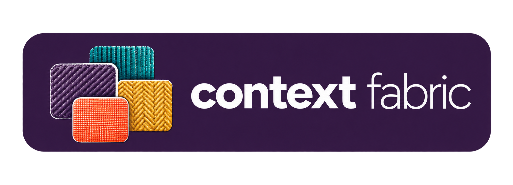

# Context Fabric

**Connected context that supports work across people, domains, and agents.**

> Draft for review. Outreach awaits owner approval and the colleague rehearsal.

## Give every team a shared starting point

Every new teammate, project and AI session needs context: how systems fit
together, where to find evidence, and what matters for the work ahead. Too often,
people rebuild that picture from scattered documents and repeated briefings.
As teams and tools change, useful knowledge gets left behind.

Context Fabric connects the knowledge people and AI agents need to do their work. Shared, versioned context describes an organization's systems, the relationships between them, and the part of that landscape relevant to each team. Maintain a fact once and bring it into the views different people need, while keeping personal paths and access settings private. Start with the work in front of you and extend that context across teams as its value grows.

The ambition is simple: let understanding accumulate as work moves between
people, teams and tools. Give a new colleague a useful starting point. Carry
shared knowledge into the next project. Help an agent work from the same
maintained context as the people directing it.

## Start where the need is

**Crawl — bring context to your own work.** Use a readable view to understand
the systems and sources relevant to a task. Carry it into a fresh agent session
without rebuilding the explanation. [Explore the individual path](individuals.md).

**Walk — build shared understanding across a team.** Maintain common facts
together, connect them to a team's working context, and give each person a
useful view without asking everyone to maintain a separate copy.
[Explore the team path](teams.md).

**Run — connect context across the organization.** Establish ownership for
shared facts, let teams reference them, and use document releases and review
practices to coordinate change across boundaries.
[Explore the organization path](organizations.md).

These are choices about the scope of your work, not tests of technical skill.
You can start at the level that fits your needs.

## See what connected context looks like

The approach has been tested by delivery teams. Explore the fictional
[Meridian Health Agency view](../../views/meridian-health-agency/view.md) to see
systems, interfaces, maintainers and source releases brought
together. The [strategy](strategy.md) records the evidence and product boundaries.

**[Start with the work you want to support](../../START-HERE.md).** Read an
existing view, draft your first context, or generate a maintained view using
the framework. Context Fabric is open source under Apache-2.0. Your
organization's documents stay in the location you choose, and its private
sources keep their existing access controls.
